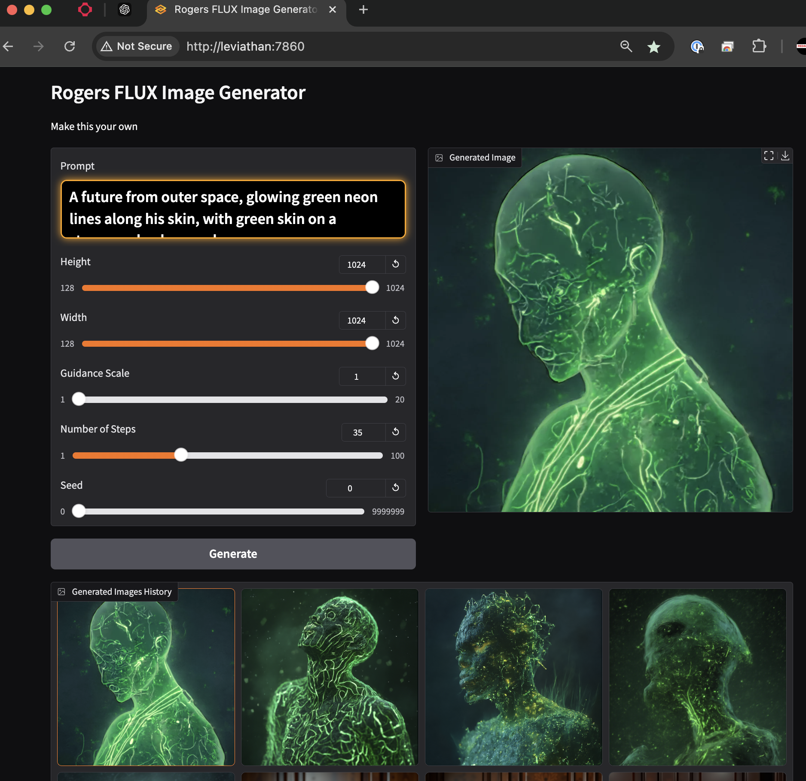

# Rogers Image Generator
🎨 Welcome to my Family-Friendly Image Generator! 🖼️

I created this magical tool to bring my kids' imaginations to life through text-to-image generation! 🪄 Using the powerful Flux model, it transforms written descriptions into beautiful artwork. While it runs smoothly on an RTX 3090 TI, you can easily adapt it for GPUs with less VRAM by selecting a smaller model. 💻

The generator comes with smart features perfect for families: 👨‍👩‍👧‍👦
- ⚡ Queue system for multiple users
- 💾 Automatic image saving to the images directory
- 🧠 Advanced memory optimization (battle-tested by hours of enthusiastic kid usage!)


## Technologies

- Flux: A text to image model
- Gradio: A UI library
- Systemd: To run the service


## Setup

Create a virtual environment and install the dependencies:

```bash
cd flux
python3 -m venv .venv
source .venv/bin/activate
pip install -r requirements.txt
pyhton app.py
```

## runflux.service

This is a systemd service that will run the image generator. You will want to adjust the working directory and user.
Copy runflux.service to /etc/systemd/system/runflux.service

```bash
cp runflux.service /etc/systemd/system/runflux.service
systemctl daemon-reload
systemctl enable runflux.service
systemctl start runflux.service
```


## License and Contact

This project is licensed under the GNU General Public License v3.0 (GPL-3.0) - see the [LICENSE](LICENSE) file for details.

### Connect With Me
- GitHub: [RamboRogers](https://github.com/RamboRogers)
- X/Twitter: [@rogerscissp](https://x.com/rogerscissp)
- Website: [matthewrogers.org](https://matthewrogers.org)


